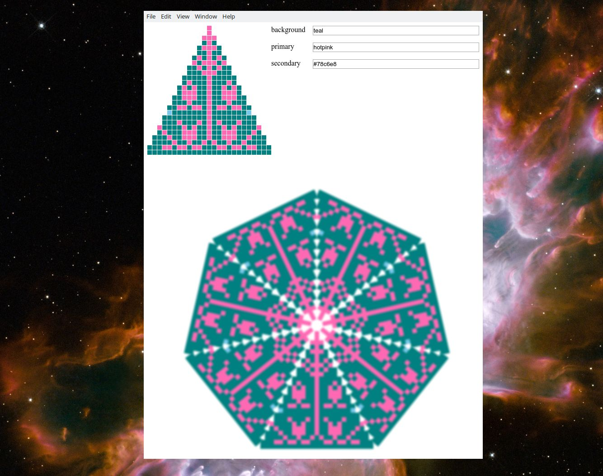

# Hatly



plan the tops of your hats with this simple visualisation

## Uage

```bash
$ npm i
$ npm start
```

## TODO

- browserify | indexhtmlify
- host online / scuttlebutt-blob / DAT
- add color-picker or link : https://duckduckgo.com/?q=colorpicker
